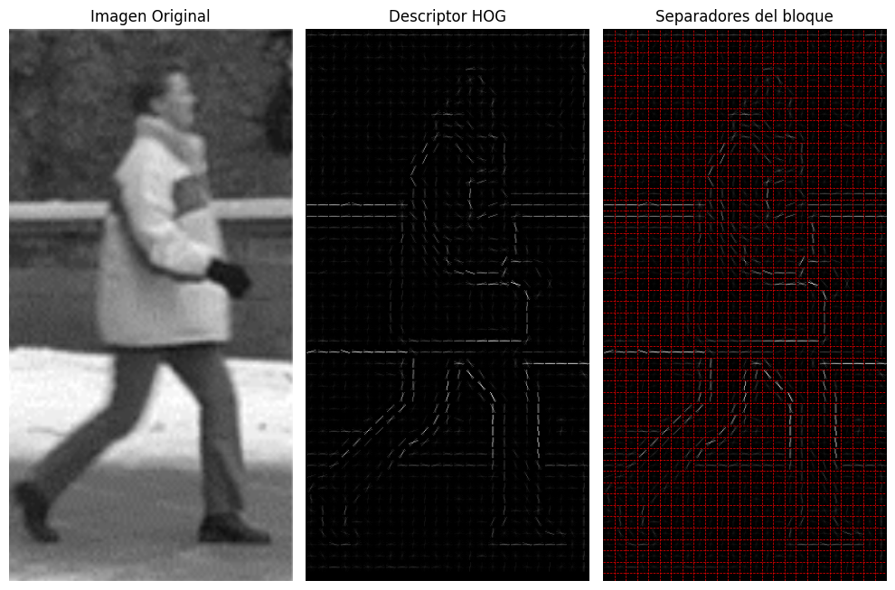
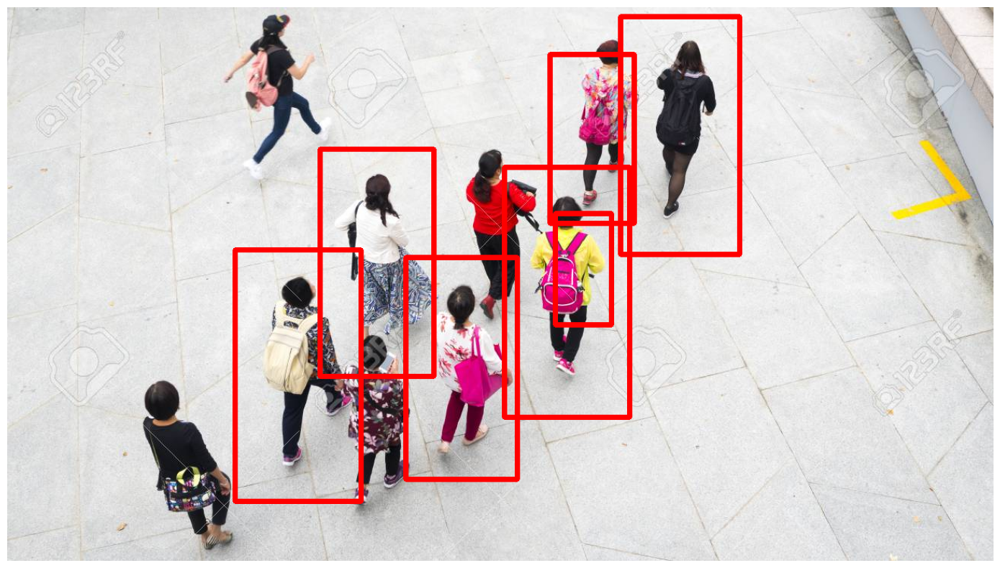

# Person Detection using HOG (Histogram of Oriented Gradients)

This project demonstrates how to detect people in images using the HOG (Histogram of Oriented Gradients) algorithm with OpenCV.

## Overview

The goal of this project is to detect people in images using a pre-trained HOG detector. The HOG algorithm is a popular method for object detection in computer vision, particularly for detecting pedestrians and other objects with well-defined shapes.

## Requirements

To run the code, you'll need the following:

- Python 3.x
- OpenCV (cv2)
- Matplotlib

You can install the required Python packages using pip:

```bash
pip install opencv-python matplotlib
```

## Usage

To use the person detection code, follow these steps:

1. Clone the repository to your local machine.
2. Navigate to the project directory.
3. Open the detect_people.ipynb Jupyter Notebook.
4. Run the cells in the notebook to execute the code.
5. Ensure the image path variable (image_path) in the notebook is set to the path of your image.

This will display the input image with rectangles drawn around the detected people.

## Examples

The first image showcases person detection using the HOG algorithm.



The second image demonstrates a trained model for identifying people within an image.



## License

This project is licensed under the MIT License

